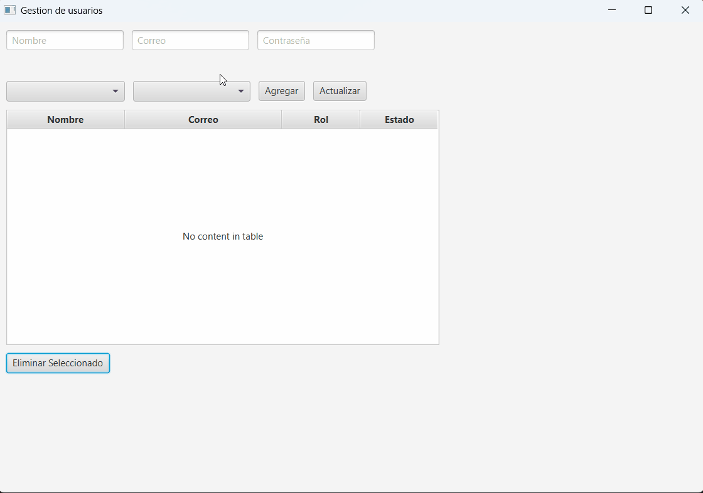

# systemUserCrud

Aplicación de gestión de usuarios (CRUD) desarrollada en JavaFX utilizando arquitectura MVC.


## Requisitos

- Java JDK 17 o superior (recomendado JDK 22 si tu proyecto lo requiere)
- Maven 3.6+
- [JavaFX SDK](https://openjfx.io/) (las dependencias ya están en el `pom.xml`)
- VS Code o cualquier IDE compatible

## Estructura del proyecto

```
systemUserCrud/
├── src/
│   ├── main/
│   │   ├── java/
│   │   │   └── com/example/systemusercrud/
│   │   │       ├── controller/
│   │   │       │   └── UserController.java
│   │   │       ├── model/
│   │   │       │   ├── User.java
│   │   │       │   └── UserDAO.java
│   │   │       └── view/
│   │   │           └── MainApp.java
│   │   └── resources/
│   │       └── com/example/systemusercrud/
│   │           └── UserView.fxml
├── pom.xml
└── README.md
```

## Cómo ejecutar

1. **Clona el repositorio**  
   ```sh
   git clone https://github.com/Elkinssm/java_fx
   cd systemUserCrud
   ```

2. **Compila y ejecuta con Maven**  
   ```sh
   mvn clean javafx:run
   ```

   > Si `mvn` no es reconocido, asegúrate de tener Maven instalado y agregado al PATH.

3. **(Opcional) Ejecuta desde tu IDE**  
   - Abre el proyecto en VS Code o tu IDE favorito.
   - Ejecuta la clase `MainApp.java` como aplicación Java.

## Personalización

- Los roles y estados se pueden modificar en el archivo `UserView.fxml` o en el controlador.
- Puedes adaptar la validación y los campos según tus necesidades.

## Uso con Docker

> ⚠️ **Importante:**  
> Antes de ejecutar la aplicación, asegúrate de que Docker esté instalado, en ejecución y que los servicios definidos en `docker-compose.yml` estén levantados.  
> Si la base de datos no está corriendo, la aplicación no podrá conectarse correctamente.

Este proyecto incluye un archivo `docker-compose.yml` para levantar una base de datos MySQL y Adminer para administración visual.

### Levantar los servicios

1. Asegúrate de tener [Docker](https://www.docker.com/products/docker-desktop/) instalado y en ejecución.
2. Desde la raíz del proyecto, ejecuta:

   ```sh
   docker-compose up -d
   ```

   Esto creará:
   - Un contenedor MySQL (`user_crud_mysql`) con la base de datos `userdb`.
   - Un contenedor Adminer (`adminer_user_crud`) accesible en [http://localhost:8080](http://localhost:8080).

3. **Conexión desde la aplicación JavaFX**  
   Configura tu aplicación para conectarse a la base de datos con estos datos:
   - **Host:** `localhost`
   - **Puerto:** `3307`
   - **Base de datos:** `userdb`
   - **Usuario:** `appuser`
   - **Contraseña:** `app123`

   Ejemplo de URL JDBC:
   ```
   jdbc:mysql://localhost:3307/userdb
   ```

4. **Acceso a Adminer**  
   Ingresa a [http://localhost:8080](http://localhost:8080) para administrar la base de datos gráficamente.
   - **Sistema:** MySQL
   - **Servidor:** mysql-db (o localhost)
   - **Usuario:** appuser
   - **Contraseña:** app123
   - **Base de datos:** userdb

5. **Detener los servicios**
   ```sh
   docker-compose down
   ```

---
## Características

- Crear, leer, actualizar y eliminar usuarios.
- Validación de campos.
- Selección de rol y estado (Activo/Inactivo) mediante ComboBox.
- Notificaciones visuales.
- Interfaz moderna con JavaFX.

## Demo



## Créditos

- Desarrollado por [Elkin Silva Manrique](https://github.com/Elkinssm).
- Basado en JavaFX y ControlsFX.

---

¡Contribuciones y sugerencias son bienvenidas!